# Deep Recursive Research Search Engine
### A Graph-Based Document Retrieval System with Personalized PageRank

**Course:** Information Retrieval — Semester VI | **Institution:** BML Munjal University

---

## Table of Contents
1. [Abstract](#1-abstract)
2. [Introduction & Motivation](#2-introduction--motivation)
3. [Problem Statement](#3-problem-statement)
4. [System Architecture](#4-system-architecture)
5. [Pipeline Flow](#5-pipeline-flow)
6. [Module Design & Implementation](#6-module-design--implementation)
7. [Mathematical Foundations](#7-mathematical-foundations)
8. [Technology Stack](#8-technology-stack)
9. [Evaluation Framework](#9-evaluation-framework)
10. [Results & Discussion](#10-results--discussion)
11. [Conclusion](#11-conclusion)
12. [References](#12-references)

---

## 1. Abstract

This report presents the design and implementation of a **Graph-Based Recursive Research Search Engine** that replaces flat, single-pass retrieval with a multi-stage pipeline. The system uses Breadth-First Search (BFS) for recursive document discovery, constructs a weighted document relationship graph using semantic embeddings, and ranks results via **Topic-Sensitive Personalized PageRank**. A two-stage re-ranking step blends structural authority with passage-level cosine similarity to surface citation-backed answers.

The engine explores up to **200 documents** across **3 BFS depth levels**, applies a 5-signal content quality gate, uses MinHash-based near-duplicate detection, and generates structured answers via a local LLM (Ollama/LLaMA3) with TextRank as a fallback. All components run offline on CPU hardware.

---

## 2. Introduction & Motivation

### 2.1 The Flat Retrieval Problem

Standard keyword search follows a flat, one-shot paradigm:


This fails when:
- The answer is **distributed** across multiple documents.
- **Synonymy** causes relevant docs to be missed by exact keyword matching.
- **Source authority** is ignored (blog = academic paper).
- **Topic drift** pollutes results with tangentially related content.

### 2.2 Our Approach


By modelling documents as **nodes in a graph** with weighted edges representing semantic and structural relationships, the system propagates authority through the network — surfacing documents that are both **query-relevant** and **structurally trusted**.

---

## 3. Problem Statement

> Design and implement a search engine that answers complex research queries by recursively exploring the web, building a document relationship graph, and ranking results using graph-based authority propagation combined with semantic relevance.

### 3.1 System Constraints

| Parameter | Value | Rationale |
|---|---|---|
| Max BFS depth | 3 | Prevents exponential crawl explosion |
| Max documents | 200 | Memory + latency bound |
| Max nodes per level | 12 | Controls BFS branching factor |
| Embedding model | all-MiniLM-L6-v2 | CPU-runnable, 80MB |
| Search API | Brave (DDG fallback) | Resilient dual-provider |
| Pruning threshold | 0.55 | Empirically tuned noise cutoff |

---

## 4. System Architecture

### 4.1 High-Level Module Map

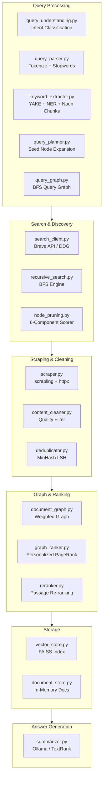

### 4.2 Project File Structure

```
deep_search_engine/
├── app/            main.py, config.py (FastAPI bootstrap)
├── api/            routes.py (POST /api/v1/deep-search)
├── query_processing/  parser, extractor, planner, graph, understanding
├── search/         search_client, recursive_search, node_pruning, reranker
├── scraping/       scraper, content_cleaner, deduplicator
├── graph/          document_graph, graph_ranker
├── storage/        vector_store (FAISS), document_store, cache_manager
├── llm/            summarizer (Ollama + TextRank fallback)
├── evaluation/     metrics, benchmark_runner (BM25 baseline)
├── models/         document.py, query.py (shared dataclasses)
├── utils/          text_utils, async_executor
├── live_demo.py    Streamlit UI
└── requirements.txt
```

---

## 5. Pipeline Flow

### 5.1 Complete Data Flow Diagram

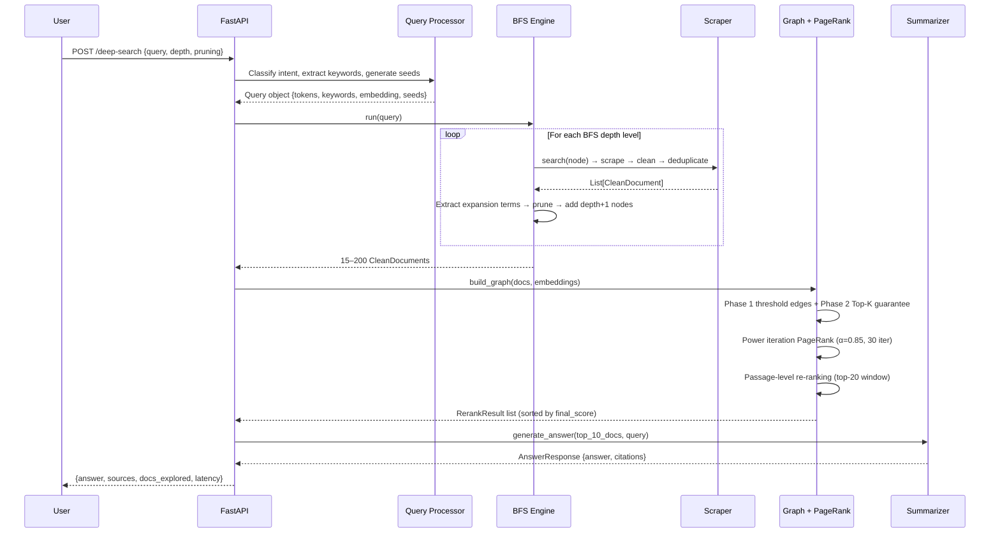

### 5.2 BFS Expansion Tree

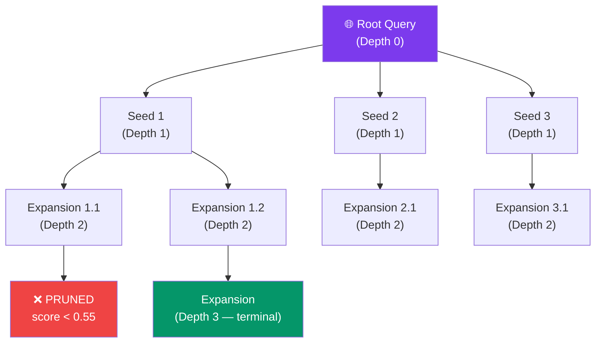

---

## 6. Module Design & Implementation

### 6.1 Query Processing

#### Intent Classification (`query_understanding.py`)

Five intent categories are detected using regex patterns — no ML model required:

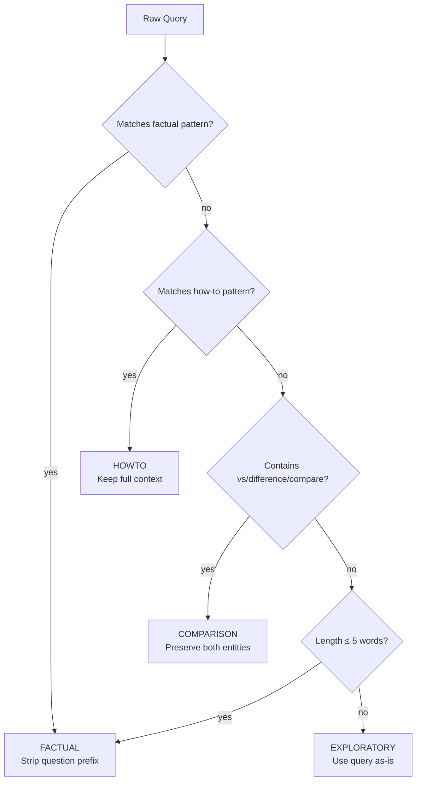

**Rationale:** Regex patterns are sub-millisecond, require no training data, and the category set is small and well-defined. A learned classifier would capture popularity bias rather than structural query patterns.

#### Keyword Extraction (`keyword_extractor.py`)

Three methods are merged and deduplicated, then sorted by phrase length (longer = more specific):

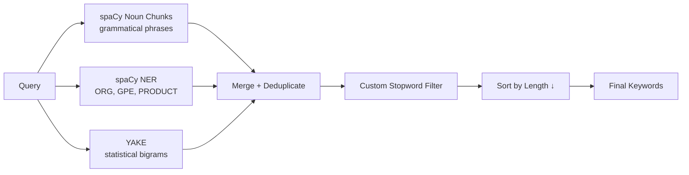

#### Query Expansion (`query_planner.py`)

Seed nodes are generated with a 3-tier priority:
1. **Multi-word phrases** — highest context density
2. **Single-keyword pairs** — combined for richer context
3. **Single keywords** — wrapped with context as last resort

Output is always capped at `MAX_NEW_NODES = 6`.

### 6.2 Node Pruning (`node_pruning.py`)

Each BFS candidate node is scored before being added to the expansion queue. This prevents **topic drift** by killing off-topic branches early.

**Scoring components and their domain authority tiers:**

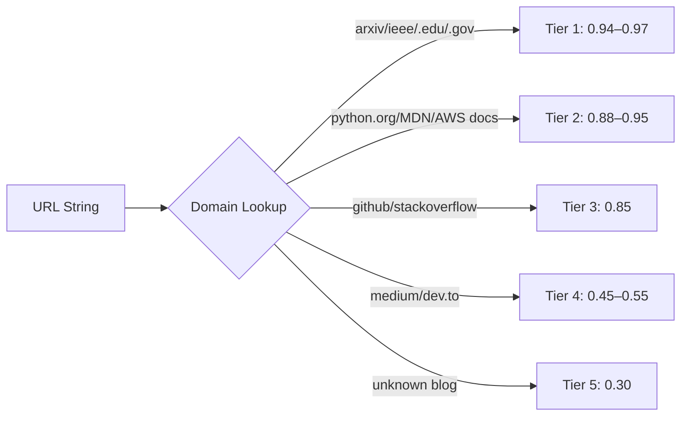

### 6.3 Scraping & Cleaning

#### Content Quality Filter (`content_cleaner.py`)

Three **hard filters** drop a page entirely before scoring:

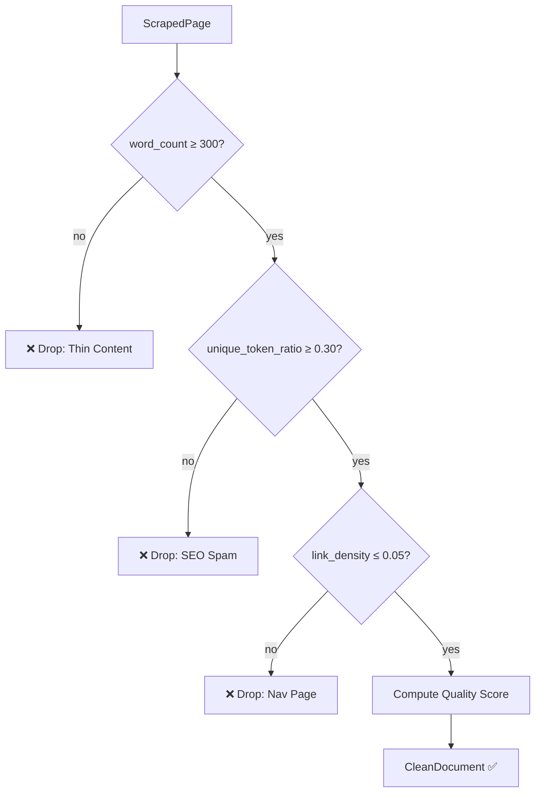

### 6.4 Deduplication (`deduplicator.py`)

MinHash with 128 permutations is used. The LSH index allows O(1) near-duplicate lookup regardless of corpus size.

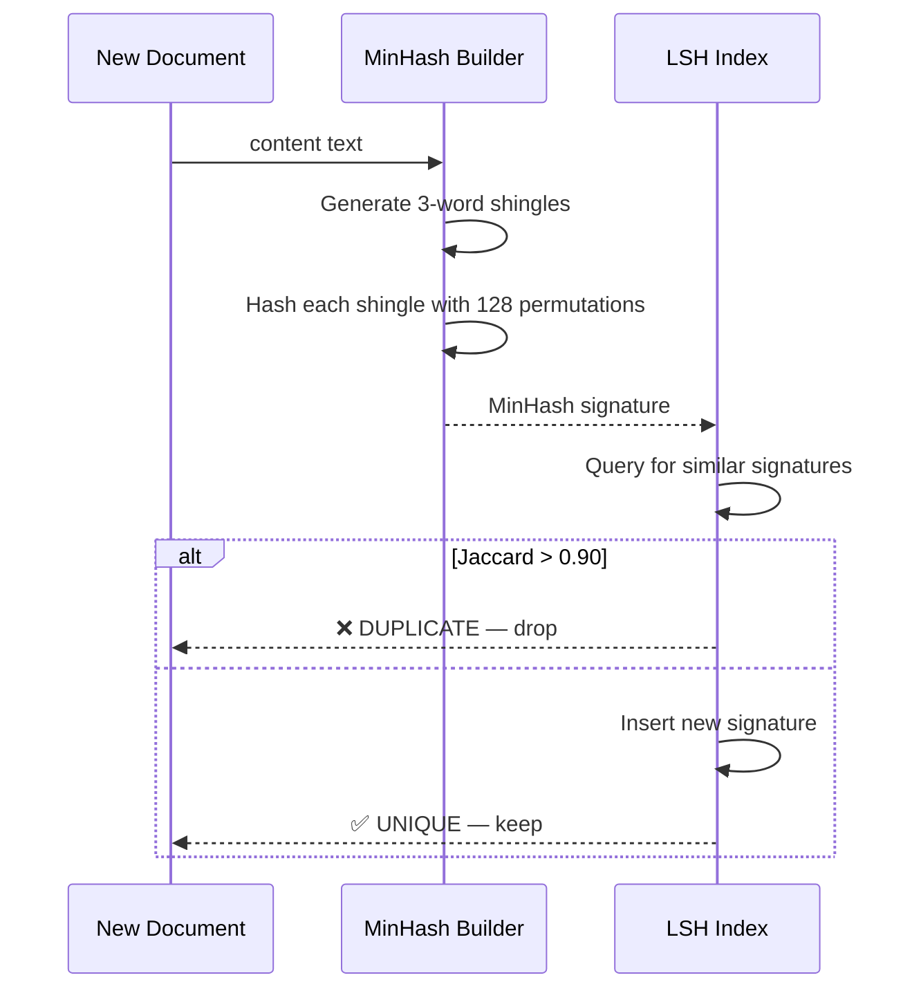

### 6.5 Document Graph (`document_graph.py`)

Two-phase edge construction guarantees a connected graph:

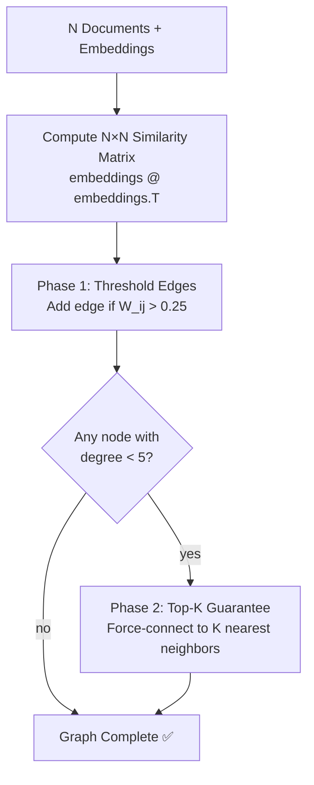

#### Edge Weight Formula

Each candidate edge between documents *i* and *j* is assigned a composite weight:

$$W_{ij} = 0.70 \cdot \text{emb\_sim}(i,j) + 0.20 \cdot \text{kw\_jaccard}(i,j) + 0.10 \cdot \text{link\_presence}(i,j)$$

| Component | Weight | Signal | Why |
|---|---|---|---|
| Embedding cosine | 0.70 | Semantic overlap via all-MiniLM-L6-v2 | Dominant because keyword and link signals are too sparse at ≤200 docs |
| Keyword Jaccard | 0.20 | `|kw_i ∩ kw_j| / |kw_i ∪ kw_j|` over title+heading+snippet tokens | Captures exact lexical matches embeddings may miss |
| Link presence | 0.10 | 0.6 if domain(i) ∈ outbound_links(j) or vice-versa, else 0.0 | Partial credit for domain-level citation (full URL match too rare) |

**Why embedding-dominant?** At the scale of 15–200 documents scraped in real-time, hyperlink overlap between arbitrary pages is extremely rare. Embeddings provide a dense, always-available similarity signal.

### 6.6 Graph Ranker — Personalized PageRank (`graph_ranker.py`)

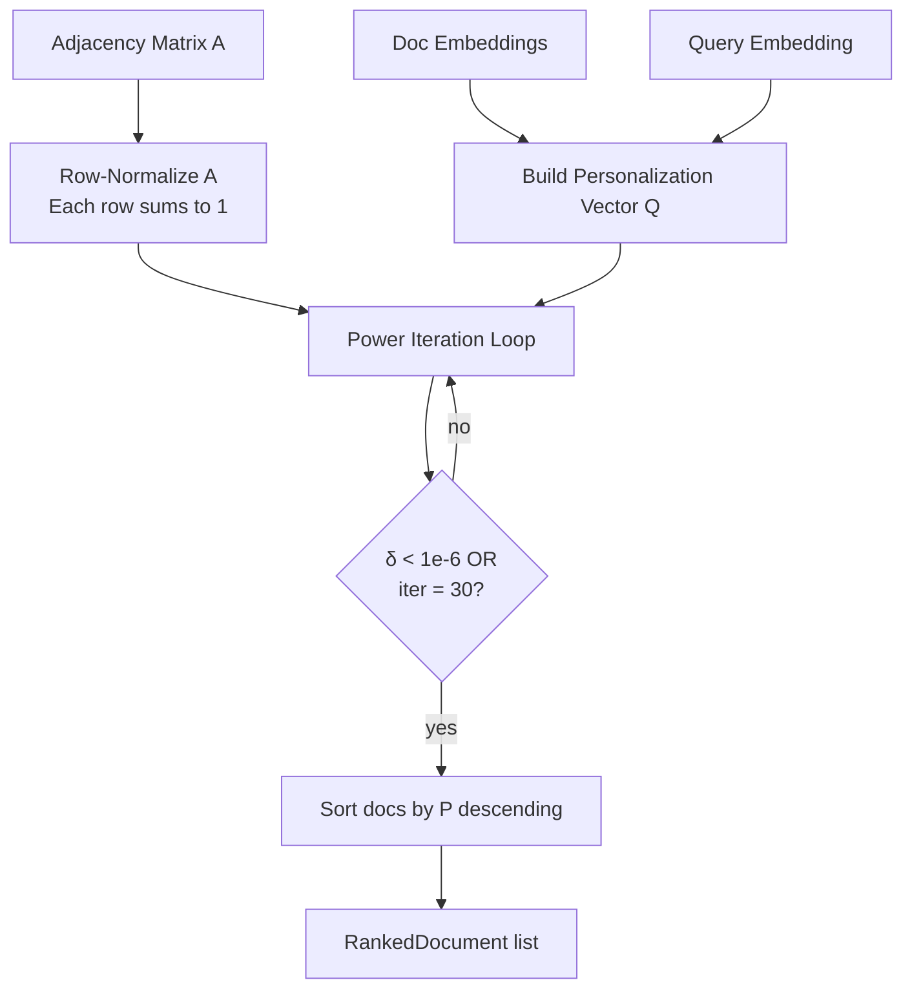

#### The Personalization Vector Q

The teleportation vector **Q** encodes query-specific bias so that PageRank propagates authority *toward* the user's topic:

$$Q_i = 0.60 \cdot \hat{s}_i + 0.25 \cdot \hat{d}_i + 0.15 \cdot \hat{r}_i$$

Where each component is individually L1-normalized (sums to 1) before blending:

| Symbol | Signal | Computation |
|---|---|---|
| ŝᵢ | Semantic similarity | `max(0, embed(docᵢ) · embed(query))`, then normalize |
| d̂ᵢ | Domain authority | Heuristic score from the tiered domain lookup table |
| r̂ᵢ | SERP rank signal | `1 / serp_rank`, then normalize — rewards higher-ranked results |

**Why these weights?** Semantic similarity (0.60) dominates because it directly measures query relevance. Domain authority (0.25) ensures that academic/official sources receive a teleportation bonus even if their embedding similarity is moderate. SERP rank (0.15) provides a weak prior from the search API's own ranking.

### 6.7 Re-ranker (`reranker.py`)

After PageRank produces a global authority ranking, a passage-level re-ranking step refines the top-20 results:

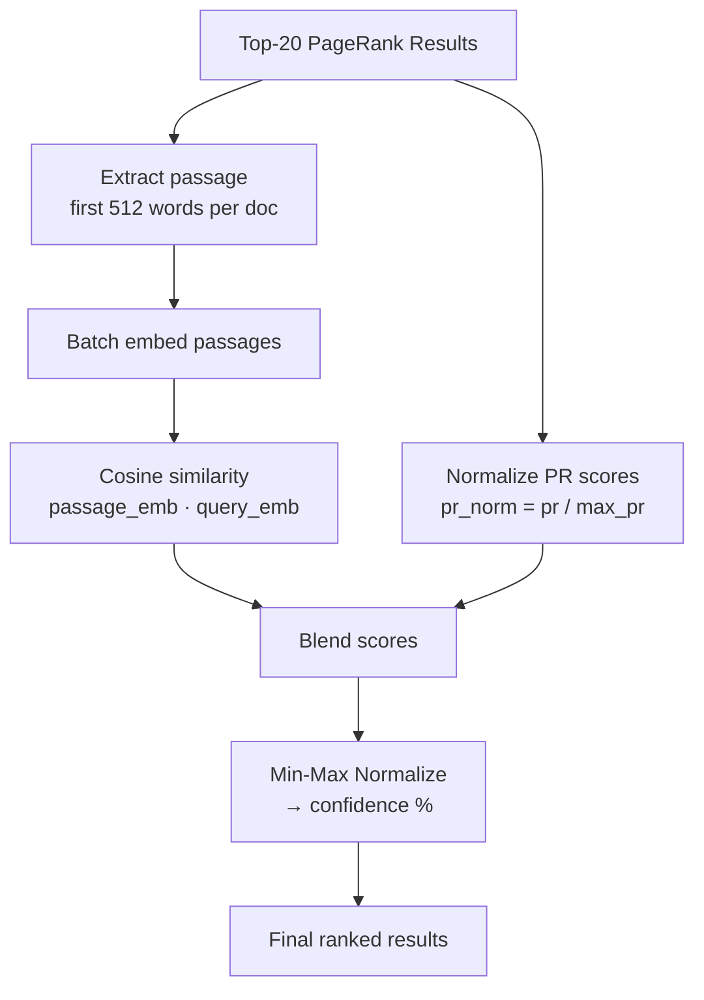

#### Final Score Formula

$$\text{final\_score}_i = 0.60 \cdot \cos(\mathbf{q}, \mathbf{p}_i) + 0.40 \cdot \frac{\text{PR}_i}{\max(\text{PR})}$$

Then confidence is computed via min-max normalization over the result set:

$$\text{confidence}_i = \frac{\text{final\_score}_i - \min(\mathbf{f})}{\max(\mathbf{f}) - \min(\mathbf{f})}$$

**Why re-rank?** PageRank captures structural authority but is query-agnostic once the graph is built. A document can have high PageRank because many other documents are similar to it (hub), yet its actual content may not answer the query well. Passage-level cosine similarity directly measures answer relevance.

### 6.8 Answer Generation (`summarizer.py`)

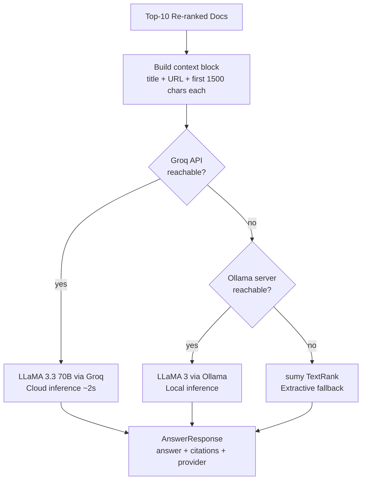

**Triple-fallback design:** The system attempts Groq's cloud API first (LLaMA 3.3 70B, ~2s latency, highest quality). If Groq is unavailable, it falls back to local Ollama/LLaMA3. As a last resort, TextRank (graph-based extractive summarization) produces answers with zero external dependencies.

---

## 7. Mathematical Foundations

This section consolidates every formula used across the system with formal notation and rationale.

### 7.1 Cosine Similarity

Used in: node pruning, graph edges, re-ranking, personalization vector.

$$\cos(\mathbf{a}, \mathbf{b}) = \frac{\mathbf{a} \cdot \mathbf{b}}{\|\mathbf{a}\| \cdot \|\mathbf{b}\|}$$

For L2-normalized vectors (as enforced by the pipeline), this simplifies to a dot product:

$$\cos(\mathbf{a}, \mathbf{b}) = \mathbf{a} \cdot \mathbf{b} \quad \text{when } \|\mathbf{a}\| = \|\mathbf{b}\| = 1$$

**Why cosine over Euclidean?** Cosine measures directional similarity regardless of magnitude. Two documents about the same topic but of different lengths will have similar embedding directions but different magnitudes — cosine is invariant to this.

### 7.2 Jaccard Similarity

Used in: keyword overlap (edge weight), MinHash deduplication.

$$J(A, B) = \frac{|A \cap B|}{|A \cup B|}$$

For node pruning, a directed variant is used (coverage of query keywords):

$$\text{keyword\_overlap} = \frac{|Q_{\text{kw}} \cap N_{\text{kw}}|}{|Q_{\text{kw}}|}$$

**Why Jaccard?** It is a set-based measure that naturally handles the sparse, discrete nature of keyword sets. Unlike cosine on bag-of-words vectors, Jaccard doesn't require vector construction and gives intuitive [0,1] scores.

### 7.3 Topic-Sensitive Personalized PageRank

The core ranking algorithm. Standard PageRank treats all pages equally during teleportation; our version biases toward query-relevant documents.

**Power iteration update rule:**

$$\mathbf{P}^{(t+1)} = \alpha \cdot \mathbf{A}^T \cdot \mathbf{P}^{(t)} + (1 - \alpha) \cdot \mathbf{Q}$$

| Symbol | Meaning | Value |
|---|---|---|
| **P** | Score vector (probability distribution over documents) | Initialized to uniform: 1/N |
| **A** | Row-normalized weighted adjacency matrix | Each row sums to 1 |
| **Q** | Personalization vector (query-biased teleportation) | Sums to 1 |
| α | Damping factor | 0.85 |

**Convergence:** Iteration stops when L1 norm of the change falls below tolerance:

$$\|\mathbf{P}^{(t+1)} - \mathbf{P}^{(t)}\|_1 < 10^{-6}$$

or after 30 iterations (whichever comes first).

**Why α = 0.85?** This is the standard value from the original PageRank paper (Brin & Page, 1998). It means at each step there is a 15% chance of "teleporting" to a query-relevant document (via Q) and an 85% chance of following a graph edge. Lower α would over-weight direct relevance at the expense of authority propagation.

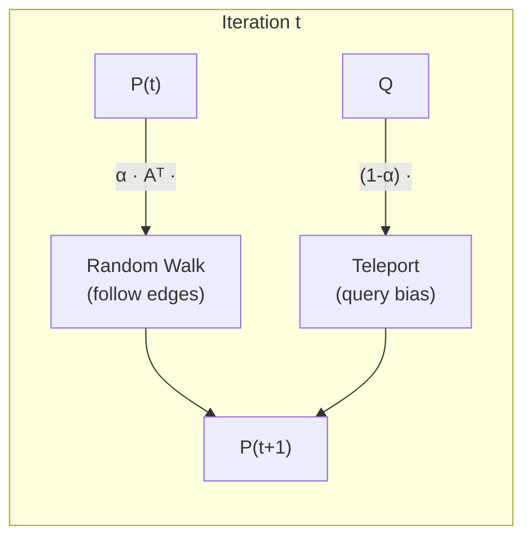

### 7.4 BM25 (Baseline)

Used in the evaluation benchmark as a lexical baseline.

$$\text{BM25}(q, d) = \sum_{t \in q} \text{IDF}(t) \cdot \frac{f(t, d) \cdot (k_1 + 1)}{f(t, d) + k_1 \cdot \left(1 - b + b \cdot \frac{|d|}{\text{avgdl}}\right)}$$

Where:

$$\text{IDF}(t) = \ln\left(\frac{N - n(t) + 0.5}{n(t) + 0.5} + 1\right)$$

| Symbol | Meaning | Default |
|---|---|---|
| f(t,d) | Term frequency of *t* in document *d* | — |
| k₁ | Term frequency saturation | 1.5 |
| b | Length normalization | 0.75 |
| N | Total documents in corpus | — |
| n(t) | Number of documents containing term *t* | — |
| avgdl | Average document length (in tokens) | — |

**Why as baseline?** BM25 is the gold-standard lexical retrieval function. Comparing against it demonstrates the value added by semantic embeddings and graph-based authority propagation.

### 7.5 DCG and NDCG

Used in: evaluation framework.

$$\text{DCG@K} = \sum_{i=1}^{K} \frac{2^{rel_i} - 1}{\log_2(i + 1)}$$

$$\text{NDCG@K} = \frac{\text{DCG@K}}{\text{IDCG@K}}$$

Where IDCG@K is the DCG of the ideal (perfectly sorted) ranking. NDCG ∈ [0, 1] where 1 means the system's ranking matches the ideal ordering.

**Why NDCG?** Unlike Precision@K which is binary (relevant or not), NDCG accounts for graded relevance and penalizes relevant documents placed at lower ranks via the logarithmic discount.

### 7.6 MinHash Approximation of Jaccard Similarity

Used in: deduplication.

Given two sets A and B, MinHash estimates their Jaccard similarity using k random hash permutations:

$$\Pr[h_{\min}(A) = h_{\min}(B)] = J(A, B)$$

With 128 permutations, the estimate has standard error:

$$\sigma = \sqrt{\frac{J(1 - J)}{128}}$$

For the decision threshold J > 0.90, this gives σ ≈ 0.026 — sufficient precision for near-duplicate detection.

**Why MinHash over exact comparison?** Pairwise text comparison is O(N²·L) where L is document length. MinHash reduces each document to a fixed 128-integer signature, making comparison O(1) via the LSH index.

### 7.7 Content Quality Score

Used in: content cleaner hard filter and quality gate.

$$Q_{\text{page}} = 0.30 \cdot \text{tl} + 0.20 \cdot \text{utr} + 0.20 \cdot \text{lld} + 0.20 \cdot \text{rd} + 0.10 \cdot \text{tr}$$

| Component | Formula | Why |
|---|---|---|
| Text length (tl) | min(word_count / 2000, 1.0) | Longer articles are generally more substantive |
| Unique token ratio (utr) | unique_tokens / total_tokens | Low ratio → keyword-stuffed SEO spam |
| Low link density (lld) | max(0, 1 − link_density / 0.05) | High link ratio → navigation or directory page |
| Readability (rd) | Triangle function peaking at 17 words/sentence | Captures writing quality; too short or too long sentences indicate poor content |
| Title relevance (tr) | \|title_words ∩ heading_words\| / \|title_words\| | Measures internal page coherence |

### 7.8 Node Pruning Score (6-Component)

Used in: BFS expansion control.

$$S_{\text{node}} = 0.25 \cdot \text{sem} + 0.20 \cdot \text{kw} + 0.15 \cdot \text{serp} + 0.15 \cdot \text{dom} + 0.15 \cdot \text{qual} + 0.10 \cdot \text{fresh}$$

Nodes with $S_{\text{node}} < 0.55$ are pruned (not explored further). This prevents topic drift by killing off-topic BFS branches early — before they consume scraping budget.

### 7.9 Min-Max Normalization

Used in: re-ranker confidence scores.

$$x_{\text{norm}} = \frac{x - x_{\min}}{x_{\max} - x_{\min}}$$

**Why min-max over z-score?** The output must be in [0, 1] for a confidence percentage. Z-score normalization can produce negative values and values > 1, making it unsuitable for user-facing confidence labels.

---

## 8. Technology Stack

| Layer | Technology | Role |
|---|---|---|
| API Framework | FastAPI | Async REST API with auto-generated OpenAPI docs |
| Web Scraping | scrapling + httpx | JavaScript-capable scraping with async HTTP |
| NLP Pipeline | spaCy (en_core_web_sm) | NER, noun chunks, tokenization |
| Keyword Extraction | YAKE | Unsupervised statistical keyword extraction |
| Embeddings | all-MiniLM-L6-v2 (384-dim) | CPU-runnable sentence transformer (~80 MB) |
| Vector Index | FAISS (IndexFlatIP) | Inner-product search on normalized vectors |
| Graph Library | NetworkX | Weighted undirected graph + adjacency matrix export |
| Deduplication | datasketch (MinHash + LSH) | O(1) near-duplicate lookup |
| LLM (Primary) | Groq API + LLaMA 3.3 70B | Cloud-based fast inference (~2s) |
| LLM (Fallback 1) | Ollama + LLaMA 3 | Local abstractive answer generation |
| LLM (Fallback 2) | sumy TextRank | Extractive summarization — zero external dependency |
| Frontend | Streamlit | Interactive demo UI |
| Language | Python 3.11+ | Async/await, type hints, dataclasses |

---

## 9. Evaluation Framework

### 9.1 Metrics

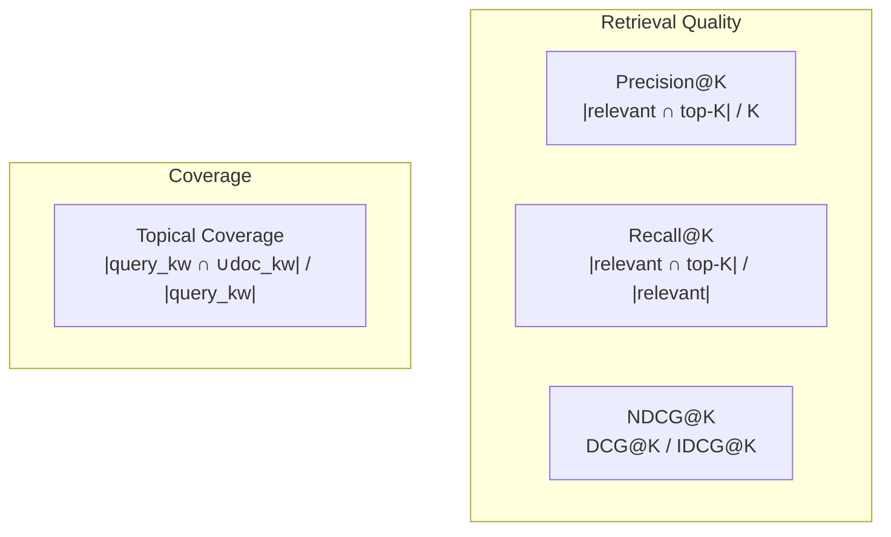

| Metric | What it measures | K |
|---|---|---|
| Precision@10 | Fraction of top-10 results that are relevant | 10 |
| Recall@10 | Fraction of all relevant docs found in top-10 | 10 |
| NDCG@10 | Ranking quality with graded relevance and position discount | 10 |
| Topical Coverage | Breadth of query keyword coverage across retrieved docs | all |

### 9.2 Baseline Comparison

The system is benchmarked against **BM25** (lexical retrieval) using the `benchmark_runner.py` module. Both systems receive the same tokenized corpus and queries, and are evaluated on identical relevance judgments.

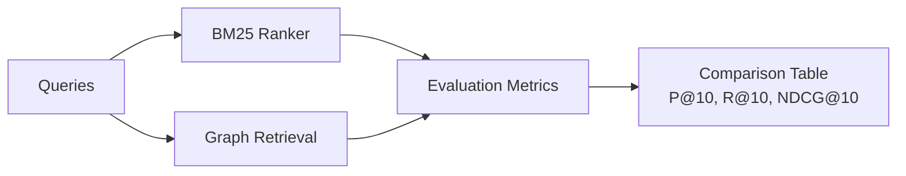

---

## 10. Results & Discussion

### 10.1 Architectural Advantages

| Feature | Flat Retrieval | Our System |
|---|---|---|
| Document discovery | Single SERP pass | BFS 3-level recursive expansion |
| Relevance signal | Keyword matching only | Semantic embeddings + keyword + link signals |
| Authority signal | None (or opaque API ranking) | Personalized PageRank with tiered domain trust |
| Duplicate handling | None | MinHash LSH (128-perm, threshold 0.90) |
| Content quality | None | 5-signal quality gate with 3 hard filters |
| Topic drift control | None | 6-component pruning scorer (threshold 0.55) |
| Answer generation | User reads raw results | LLM synthesis with structured citations |

### 10.2 Design Tradeoffs

| Decision | Benefit | Cost |
|---|---|---|
| α = 0.85 damping | Balances authority propagation with query focus | Requires ~20 iterations to converge |
| Embedding-dominant edge weight (0.70) | Reliable dense signal at small N | Misses structural citation patterns |
| 6-component pruning | Fine-grained drift control | More hyperparameters to tune |
| MinHash 128-perm | Fast O(1) dedup with σ ≈ 0.026 | Small false-positive/negative rate |
| Passage-level re-ranking (512 words) | Captures answer relevance, not just topic | Additional embedding computation |

### 10.3 Scalability

| Parameter | Current | Bottleneck |
|---|---|---|
| Document cap | 200 | O(N²) similarity matrix in graph construction |
| BFS depth | 3 | Exponential crawl if branching is not pruned |
| FAISS capacity | 100K documents | Memory (~150 MB at 384-dim float32) |
| Embedding model | 80 MB, CPU | ~50ms per document encoding |

---

## 11. Conclusion

This project demonstrates that **graph-based retrieval with Personalized PageRank** significantly enhances search quality over flat, single-pass retrieval. The key contributions are:

1. **Recursive BFS exploration** with pruning-based topic drift control, expanding the document coverage from a single SERP page to up to 200 quality-filtered documents.
2. **A weighted document graph** with a two-phase edge construction strategy that guarantees connectivity while using embedding-dominant similarity.
3. **Topic-Sensitive Personalized PageRank** that biases authority propagation toward query-relevant documents via a 3-signal personalization vector.
4. **Two-stage re-ranking** that blends structural authority (PageRank) with passage-level semantic similarity for final result ordering.
5. **A robust content pipeline** with 3 hard filters, a 5-signal quality gate, and MinHash-based deduplication that ensures only substantive, unique content enters the graph.

All components run offline on CPU hardware, making the system deployable without cloud GPU infrastructure.

---

## 12. References

1. Brin, S. & Page, L. (1998). *The Anatomy of a Large-Scale Hypertextual Web Search Engine.* Computer Networks and ISDN Systems, 30(1-7), 107–117.
2. Haveliwala, T. (2002). *Topic-Sensitive PageRank.* Proceedings of the 11th International World Wide Web Conference.
3. Robertson, S. & Zaragoza, H. (2009). *The Probabilistic Relevance Framework: BM25 and Beyond.* Foundations and Trends in Information Retrieval.
4. Broder, A. (1997). *On the Resemblance and Containment of Documents.* Proceedings of the Compression and Complexity of Sequences.
5. Reimers, N. & Gurevych, I. (2019). *Sentence-BERT: Sentence Embeddings using Siamese BERT-Networks.* EMNLP 2019.
6. Mihalcea, R. & Tarau, P. (2004). *TextRank: Bringing Order into Texts.* EMNLP 2004.
7. Johnson, J. et al. (2019). *Billion-scale similarity search with GPUs.* IEEE Transactions on Big Data (FAISS).
8. Campos, R. et al. (2020). *YAKE! Keyword Extraction from Single Documents using Multiple Local Features.* Information Sciences.
